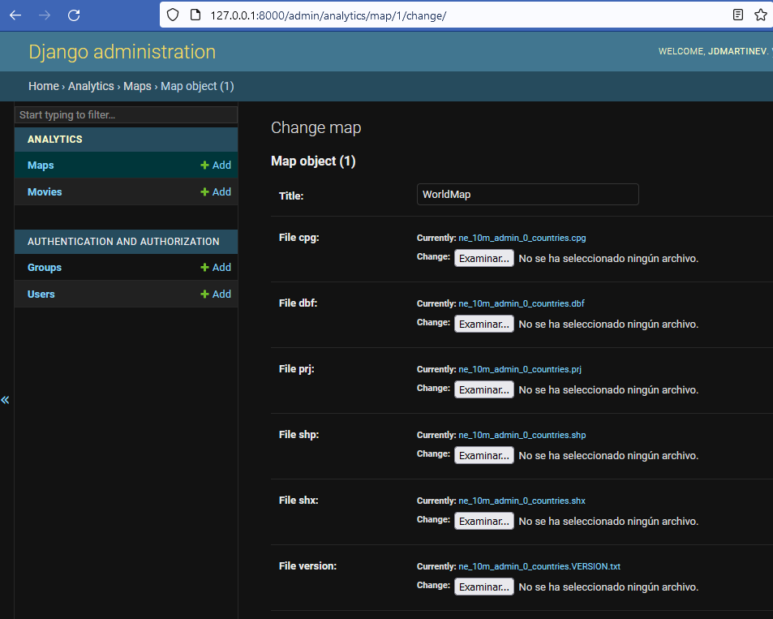

<a name="readme-top"></a>

<!-- PROJECT LOGO -->
<br />
<div align="center">
  <a href="https://github.com/othneildrew/Best-README-Template">
    
  </a>

  <h3 align="center">Workshop analítca de datos</h3>

  <p align="center">
    Proyecto de analítica de datos para el curso Proyecto Integrador 1 de Ingeniería de Sistemas - Universidad EAFIT
    <br />
    <a href="https://github.com/jdmartinev/IMDBAnalytics/IMDBAnalyticsProject"><strong>Proyecto base </strong></a>
    <br />
  </p>
</div>

<!-- TABLE OF CONTENTS -->
<details>
  <summary>Tabla de contenidos</summary>
  <ol>
    <li>
      <a href="#acerca-del-proyecto">Acerca del proyecto</a>
    </li>
    <li>
      <a href="#Instalación">Instalación</a>
    </li>
    <li><a href="#Analítica de datos en google colab">Usage</a></li>
    <li><a href="#Analítica de datos en django">Roadmap</a></li>
  </ol>
</details>


<!-- ABOUT THE PROJECT -->
## Acerca del proyecto

<!-- ABOUT THE PROJECT -->
## Instalación

Para este proyecto se partirá de las instalaciones que se hicieron para el taller 1 (django & git). 

Adicionalmente, se deberá instalar:

1. pandas
  ```sh
  pip install pandas  
  ```
2. matplotlib
  ```sh
  pip install matplotlib  
  ```

<!-- Analítica de datos en django -->
## Analítica de datos en Django

### Proyecto base
Lo primero será revisar que el proyecto esté copiado correctamente desplegando el servidor. Para esto, desde la terminal ubicada en la carpeta del proyecto (IMDBAnalyticsProject), escriba lo siguiente

  ```sh
  python manage.py runserver  
  ```
 <div align="center">
  <a>
    
  </a>
  </div>
  
Desde el navegador, acceda al servidor local http://127.0.0.1:8000/ donde se deberá ver algo de esta forma:

 <div align="center">
  <a>
    
  </a>
  </div>


Después, debe crear un super usuario para revisar que los archivos necesarios se encuentren en la base de datos.
Para esto, escriba en consola:

  ```sh
  python manage.py createsuperuser   
  ```

Ingrese el nombre de usuario y contraseña. Después, despliegue de nuevo el servidor e ingrese a la interfaz de administrador http://127.0.0.1:8000/admin.
Ingrese su nombre de usuario y contraseña, deberá ver lo siguiente:

 <div align="center">
  <a>
    
  </a>
  </div>

Si navega en los modelos existentes (Movie y Map), puede observar que tiene 1 mapa 

 <div align="center">
  <a>
    
  </a>
  </div>
  
 y más de 5000 películas en la base de datos.
  
  <div align="center">
  <a>
    
  </a>
  </div>
  
### Modificación del proyecto base

Ahora, en el editor de códio que esté utilizando, va a modificar el archivo views.py que se encuentra en la aplicación analytics. En este archivo incluiremos las librerías necesarias para procesar los datos que se cargarán desde los modelos Movie y Map, y las librerías necesarias para su procesamiento y graficación.

Incluya las liberías que se muestran en las líneas 4 a la 14


